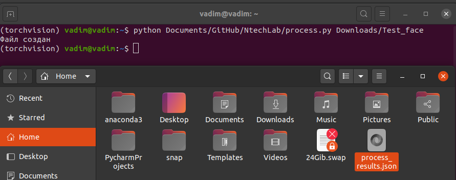

# Процесс тренировки: </h1>

Для тренировки модели были применены минимальные трансформации, такие как RandomCrop и RandomHorizontalFlip,

Помимо этого данные были приведены к виду mean=[0.485, 0.456, 0.406] и std=[0.229, 0.224, 0.225]

Данные были разделены на тренеровочный и валидационный сет в соотношении 80% и 20% соответственно	

За основу была взята модель resnext50_32x4d, предобученная на ImageNet, после чего к сети было добавлены 2 линейных слоя с dropout = 20%

Модель была обучена на 10 эпохах со скоростью обучения равной 0.0015 ,

Удалось достичь точности на валидационном наборе 98,4%

# Получение результатов модели: </h1>

Для получения результатов модели, нужно запустить файл __process.py__, указав путь к папке в которой находятся фотографии лиц, которые вы хотите предсказать

# Инструкция для запуска и обучения модели: </h1>
Инструкция для запуска и обучения модели:

Для обучения необходимо раскомментировать код и заменить путь в переменной data_dir на путь к нужной папке, содержащей 2 подпапки, в каждой из которых находятся изображения отсортированные по классам
